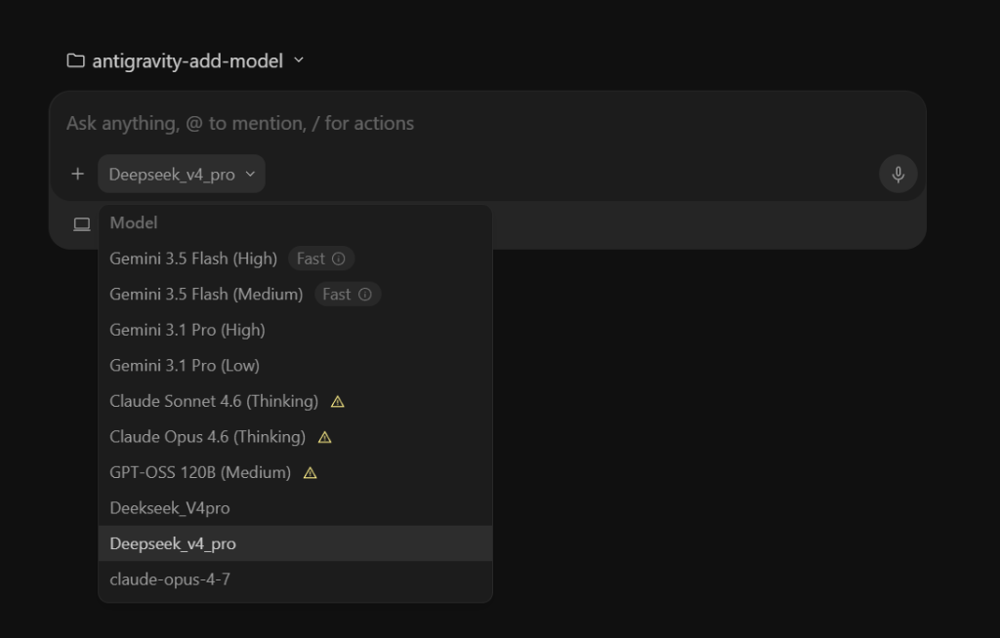
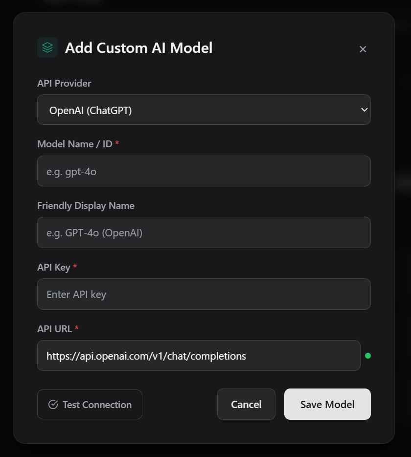
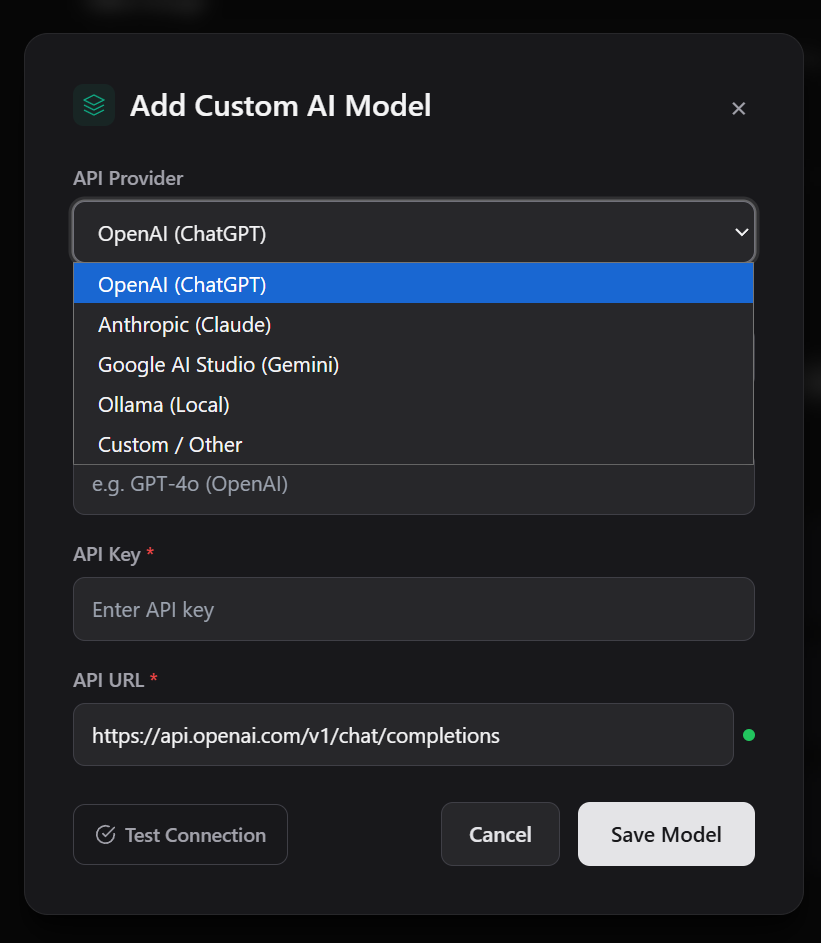
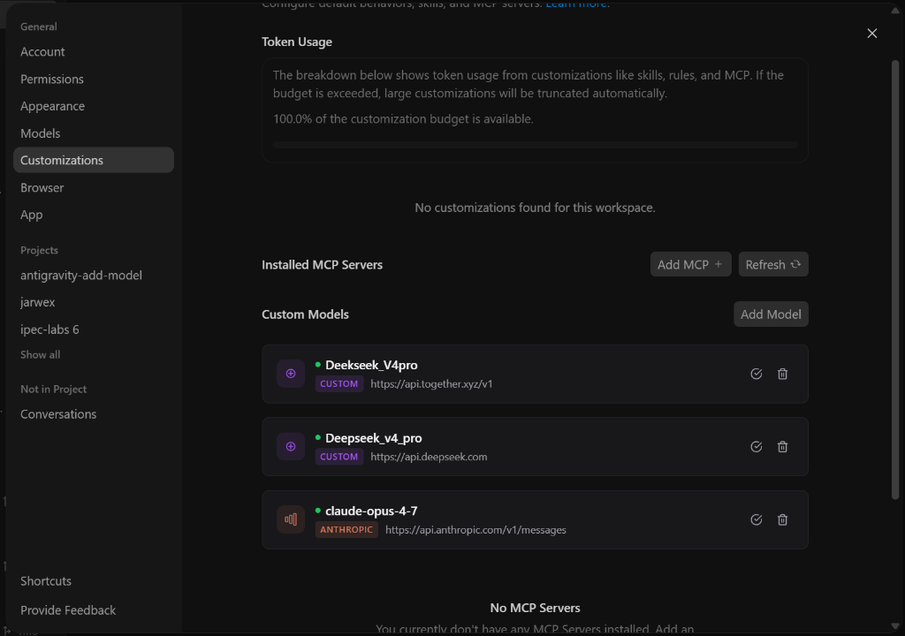

# Antigravity Custom Model Enabler

This repository contains a patch for **Google Antigravity** that enables external AI models (OpenAI, Anthropic, Together API, Ollama, Google AI Studio, and any OpenAI-compatible provider) alongside the built-in Gemini models. It injects a local HTTP proxy into the Electron app, reverse-engineers the Cloud Code internal API (`v1internal`), translates request/response formats between providers, and provides an inline "Add Model" UI in the Settings page.

## How It Works

### Architecture

```
Antigravity IDE
  └── Language Server (Go binary)
        └── --api_server_url → http://127.0.0.1:50999 (local proxy)
                                  ├── Google models → daily-cloudcode-pa.googleapis.com
                                  └── Custom models → external API (Together, OpenAI, etc.)
```

### Key Components

#### Proxy Core
| File | Role |
|---|---|
| [proxy.ts](src/proxy.ts) | Local HTTP proxy: intercepts Cloud Code API, merges custom models, translates provider formats, wraps responses |
| [registry.ts](src/proxy/registry.ts) | Auto-discovery translator registry that dynamically loads `openai`, `anthropic`, `google`, and `ollama` translators |
| [shared.ts](src/proxy/shared.ts) | Cross-turn state management with automatic TTL cleanup |
| [modelUtils.ts](src/proxy/modelUtils.ts) | Centralized model capability detection (thinking, DeepSeek, Claude) |

#### Format Translators
| File | Role |
|---|---|
| [openai.ts](src/proxy/translators/openai.ts) | OpenAI ↔ Gemini format translation (request, response, streaming chunks, tool calls) |
| [anthropic.ts](src/proxy/translators/anthropic.ts) | Anthropic ↔ Gemini format translation (Claude tool_use, SSE streaming, thinking support) |
| [google.ts](src/proxy/translators/google.ts) | Google AI Studio passthrough with streaming endpoint routing |
| [ollama.ts](src/proxy/translators/ollama.ts) | Ollama ↔ Gemini format translation (OpenAI-compatible local LLMs) |
| [utils.ts](src/proxy/translators/utils.ts) | Shared translator utilities (tool call mapping, DSML parsing, parameter type fixing) |

#### Security & Data
| File | Role |
|---|---|
| [cryptoStore.ts](src/cryptoStore.ts) | AES-256-GCM API key encryption via Electron `safeStorage` |
| [schemaValidator.ts](src/schemaValidator.ts) | Runtime schema validation for API responses, custom models, and streaming chunks |

#### UI & App Integration
| File | Role |
|---|---|
| [preload.ts](src/preload.ts) | UI injection: Custom Models dashboard in Settings → Models, inline Add Model modal with animations, connectivity test button |
| [main.ts](src/main.ts) | App lifecycle: intercepts and blocks `SetCloudCodeURL` requests to prevent the frontend from overriding the proxy endpoint |
| [ipcHandlers.ts](src/ipcHandlers.ts) | Backend IPC: `storage:get-custom-models`, `storage:save-custom-model`, `storage:delete-custom-model`, `storage:test-model-connection` |
| [languageServer.ts](src/languageServer.ts) | Modified language server manager, starts proxy on app launch |

#### Deployment Scripts
| File | Platform |
|---|---|
| [deploy.ps1](deploy.ps1) | Windows — stops Antigravity, packs `dist/` into `app.asar`, restarts |
| [deploy.sh](deploy.sh) | macOS — extracts `app.asar` from `/Applications/`, replaces `dist/`, repacks and relaunches |
| [deploy_linux.sh](deploy_linux.sh) | Linux — auto-detects installation path across standard Electron app directories |
| [repack.ps1](repack.ps1) | Repacks existing `app.asar` with updated `dist/` files |

> [!NOTE]
> The codebase was migrated from JavaScript (`dist/`) to **TypeScript** (`src/`) in v2.0.3. All source code lives under `src/` and compiles to `dist/` via `npx tsc`. The compiled `dist/` files are what get packed into `app.asar`.

### Cloud Code API Reverse Engineering

Antigravity uses Google's **Cloud Code internal API** (`v1internal:*` endpoints) instead of the public Gemini API. The proxy handles these differences:

1. **fetchAvailableModels**: Intercepts and injects custom model definitions. Custom model slugs are added to `agentModelSorts` so they appear in the chat model dropdown. Quota info is omitted for custom models since they use the user's own API key.

2. **streamGenerateContent/generateContent**: Cloud Code wraps the Gemini request inside a `request` field:
   ```json
   {
     "project": "...",
     "requestId": "...",
     "request": { "contents": [...], "systemInstruction": {...}, "generationConfig": {...} },
     "model": "custom-deepseek-ai-deepseek-v4-pro"
   }
   ```
   The proxy extracts `request` before format translation.

3. **systemInstruction**: Cloud Code sends model identity/tool definitions in a separate `systemInstruction` field (not inside `contents`). The proxy maps this to OpenAI's `role: "system"` or Anthropic's `system` parameter.

4. **Response envelope**: Cloud Code wraps responses in `{"response": {...}, "traceId": "...", "metadata": {}}`. The proxy mirrors this format so the IDE accepts the response.

### Request/Response Flow

```
1. User selects custom model and sends message
2. IDE → POST /v1internal:streamGenerateContent?alt=sse → local proxy
3. Proxy detects custom model match (by slug or hash-based MODEL_PLACEHOLDER_* ID)
4. Extracts reqJson.request → maps systemInstruction + contents to provider format
5. POST to external API (e.g. https://api.together.xyz/v1/chat/completions)
6. Maps external response back to Gemini format
7. Wraps in Cloud Code envelope {"response": {...}, "traceId": "", "metadata": {}}
8. Returns SSE: data: {envelope}\n\n → IDE displays response
```

### Streaming Fix (Critical)

The proxy differentiates between **metadata requests** (which need buffering for URL rewriting) and **generation requests** (which must be streamed directly). If the proxy buffers `streamGenerateContent` or `generateContent` responses, the Go language server times out waiting for the stream to end, causing the app to crash with "terminated due to error."

- **Metadata requests** (`v1internal:*` excluding generation): Buffered, decompressed, URL-rewritten to point back to local proxy
- **Generation requests** (`streamGenerateContent`, `generateContent`): Piped directly without buffering, preserving real-time streaming

### SetCloudCodeURL Blocking

The Antigravity frontend periodically attempts to call `SetCloudCodeURL` which would override the local proxy endpoint with the default Google API URL. The `main.ts` process intercepts and **cancels** these requests via `webRequest.onBeforeRequest`, ensuring the language server always routes through the local proxy.

### DSML Tool Call Parser

DeepSeek models (and some other providers) return tool calls in a custom **DSML** (DeepSeek Markup Language) format embedded in text content:

```xml
<DSML|invoke name="search_web">
  <DSML|parameter name="query" string="true">latest news</DSML|parameter>
</DSML|invoke>
```

The proxy automatically detects DSML blocks, parses them into Gemini-format `functionCall` objects, and strips the XML from the displayed text. Native OpenAI `tool_calls` and Anthropic `tool_use` blocks are also supported.

### Anthropic Tool Calling

Claude models (`anthropic` provider) return tool calls as `tool_use` content blocks. The proxy maps these to Gemini-format `functionCall` parts, sets `finishReason: "TOOL_CALL"`, and stores tool call IDs for later matching with `functionResponse` objects in subsequent turns. Both streaming (SSE `content_block_start`/`content_block_delta`) and non-streaming responses are fully handled.

### Security: API Key Encryption

All API keys are encrypted at rest using **AES-256-GCM** via Electron's `safeStorage`. The `cryptoStore.ts` module provides:

- **Transparent encryption/decryption**: Keys are encrypted before writing to disk, decrypted on-the-fly when loaded into memory.
- **Auto-migration**: On first run after the encryption update, any legacy plaintext `custom_models.json` config is automatically detected, encrypted, and rewritten.
- **Masked display**: API keys in the UI are shown as `sk-...XXXX` (last 4 chars only) to prevent shoulder-surfing.
- **OS-level key storage**: On macOS, `safeStorage` uses the Keychain; on Windows, it uses DPAPI.

### Dynamic Port Management

The local proxy uses **dynamic port allocation** with automatic fallback:

```typescript
// proxy.ts → startProxy()
server.listen(50999, ...);  // Try default port
server.on('error', (e) => {
  if (e.code === 'EADDRINUSE') {
    server.listen(0, ...);  // Fallback: let OS pick a free port
  }
});
```

If the default port `50999` is already in use (e.g., by another instance or stale process), the proxy automatically falls back to a random available port (`port: 0`). The `languageServer.ts` module reads the dynamically assigned port and injects it into the Go language server's `--api_server_url` argument at startup, ensuring the chain always stays connected.

### Parallel Request Isolation

Multiple models can now make simultaneous requests without cross-contamination. Previously, global variables like `lastToolCallIds` and `lastReasoningContent` could be overwritten by concurrent requests from different models. These have been migrated to **per-model `Map` structures**:

- `modelToolCallIds` (`Map<modelName, { fnName: toolCallId }>`) keeps tool call ID tracking scoped per model
- `modelReasoningContent` (`Map<modelName, string>`) keeps DeepSeek reasoning state scoped per model
- `activeStreamContexts` (`Map<streamId, context>`) keeps streaming accumulator scoped per stream

### Automatic State Cleanup

Proxy state is automatically cleaned up via a managed garbage collection interval:
- **Stream contexts**: TTL 10 minutes
- **Tool call IDs & reasoning**: TTL 30 minutes
- Interval starts with `startProxy()` and stops with `stopProxy()`, preventing orphaned timers

### Schema Validation

The `schemaValidator.ts` module provides runtime validation to catch malformed API responses before they reach the IDE frontend, preventing cryptic errors. Exported validators include:

| Function | Validates |
|---|---|
| `validateCandidate` | Individual Gemini candidate structure |
| `validateGenerateContentResponse` | Full Gemini response payload |
| `validateCloudCodeEnvelope` | Cloud Code `{ response, traceId, metadata }` wrapper |
| `validateCustomModel` | Single custom model config (provider enum, URL format) |
| `validateCustomModels` | Array of custom model configs |
| `validateGenerateContentRequest` | Request body structure |
| `validateOpenAiChunk` | OpenAI streaming chunk |
| `validateAnthropicEvent` | Anthropic SSE event type |

### Model Connectivity Test

Each custom model in Settings has a **"Test Connection"** button that sends a lightweight request to the model's API endpoint:

- Quick connectivity check (10-second timeout)
- Green ✅ or red ❌ status indicator
- Helpful error messages for common issues (auth, timeout, SSL)
- Implemented via IPC: `storage:test-model-connection`

### Request Retry & Rate Limiting

The proxy automatically retries failed requests with exponential backoff:

- **Triggers**: 429 (Rate Limit), 502, 503, 504 (Server Errors)
- **Backoff**: 1s → 2s → 4s → 8s (max 3 retries)
- **Retry-After**: Respects server-sent `Retry-After` header
- **Configurable**: `maxRetries` field in model config (default: 3)

## Repository Structure

```
antigravity-add-model/
├── src/
│   ├── proxy.ts                   # HTTP proxy + Cloud Code interceptor + format translation
│   ├── proxy/
│   │   ├── registry.ts            # Auto-discovery translator registry
│   │   ├── shared.ts              # Cross-turn state management + TTL cleanup
│   │   ├── modelUtils.ts          # Centralized model capability detection
│   │   └── translators/
│   │       ├── openai.ts          # OpenAI ↔ Gemini translator
│   │       ├── anthropic.ts       # Anthropic ↔ Gemini translator
│   │       ├── google.ts          # Google AI Studio passthrough + stream routing
│   │       └── utils.ts           # Shared translator utilities (DSML, tool calls)
│   ├── languageServer.ts          # Modified language server manager
│   ├── ipcHandlers.ts             # Custom model CRUD + connectivity test IPC
│   ├── cryptoStore.ts             # AES-256-GCM API key encryption/decryption
│   ├── schemaValidator.ts         # Runtime schema validation for responses & models
│   ├── preload.ts                 # Settings UI injection (inline Add Model dashboard)
│   ├── main.ts                    # App lifecycle + SetCloudCodeURL blocking
│   ├── constants.ts               # Port & cert constants
│   ├── paths.ts                   # Path utilities
│   ├── storage.ts                 # StorageManager class
│   ├── menu.ts                    # Application menu
│   ├── tray.ts                    # System tray
│   ├── updater.ts                 # Auto-updater
│   ├── customScheme.ts            # Plugin scheme handler
│   ├── keybindings.ts             # Keyboard shortcuts
│   ├── loadingOverlay.ts          # Loading screen overlay
│   ├── types.ts                   # Type definitions
│   ├── utils.ts                   # Window management & utilities
│   ├── services/
│   │   └── settingsService.ts
│   ├── ideInstall/                # IDE installation wizard
│   ├── __tests__/                  # Unit tests (vitest)
│   │   ├── registry.test.ts
│   │   ├── proxy.test.ts
│   │   ├── modelUtils.test.ts
│   │   ├── anthropic.test.ts
│   │   ├── openai.test.ts
│   │   └── utils.test.ts
│   ├── __mocks__/                 # Test mocks
├── dist/                          # Compiled JavaScript output
├── tsconfig.json                  # TypeScript configuration
├── deploy.ps1                     # Portable PowerShell deploy script
├── repack.ps1                     # ASAR repack script
├── package.json                   # Electron app manifest
└── README.md
```

## Supported Providers

You can configure **multiple models from different providers simultaneously**. All of them will appear together in the model selection dropdown in the Antigravity chat interface, and you can switch between them in real-time.

<p align="center">
  
</p>

| Provider | Format | Environment Variable / Key | Default API URL |
|---|---|---|---|
| **OpenAI** | `openai` | `apiKey` (or `OPENAI_API_KEY`) | `https://api.openai.com/v1/chat/completions` |
| **Anthropic** | `anthropic` | `apiKey` (or `ANTHROPIC_API_KEY`) | `https://api.anthropic.com/v1/messages` |
| **OpenRouter** | `openrouter` | `apiKey` (OpenRouter API Key) | `https://openrouter.ai/api/v1/chat/completions` |
| **Ollama** (Local) | `ollama` | *(None required)* | `http://localhost:11434/v1/chat/completions` |
| **Google AI Studio** | `google` | `apiKey` *(Gemini API Key)* | `https://generativelanguage.googleapis.com/v1beta/models/gemini-pro:generateContent` |
| **DeepSeek** | `deepseek` | `apiKey` | `https://api.deepseek.com/anthropic` |
| **Groq** | `groq` | `apiKey` | `https://api.groq.com/openai/v1` |
| **Mistral** | `mistral` | `apiKey` | `https://api.mistral.ai/v1` |
| **Cerebras** | `cerebras` | `apiKey` | `https://api.cerebras.ai/v1` |
| **Kimi (Moonshot)** | `kimi` | `apiKey` | `https://api.moonshot.ai/anthropic/v1` |
| **Fireworks AI** | `fireworks` | `apiKey` | `https://api.fireworks.ai/inference/v1` |
| **LM Studio** (Local) | `lmstudio` | *(None required)* | `http://localhost:1234/v1` |
| **llama.cpp** (Local) | `llamacpp` | *(None required)* | `http://localhost:8080/v1` |
| **NVIDIA NIM** | `nvidia` | `apiKey` | `https://integrate.api.nvidia.com/v1` |
| **Custom** (OpenAI-compatible) | `custom` | `apiKey` *(Provider API Key)* | Any OpenAI-compatible endpoint |

> [!NOTE]
> For the **Custom** provider, URLs ending in `/v1` automatically get `/chat/completions` appended. It is fully compatible with Together AI, OpenRouter, Groq, Mistral, and any other OpenAI-compliant endpoint.

> [!NOTE]
> **OpenRouter** provides unified access to 300+ models (OpenAI, Anthropic, Google, Meta, DeepSeek, etc.) through a single API. It uses the OpenAI-compatible format with Bearer token auth and optional `HTTP-Referer` / `X-Title` headers for ranking.

> [!NOTE]
> For **Google AI Studio**, provide the full endpoint URL or just the base `https://generativelanguage.googleapis.com/v1beta/models/`. The proxy auto-detects `streamGenerateContent` vs `generateContent` based on whether the request is streaming.

---

## Installation

### One-Click Re-Deploy (After Antigravity Updates)

When Google releases a new Antigravity version, the update replaces the Language Server binary and custom models stop working. Simply run:

```
repatch.bat
```

Or double-click `repatch.bat` in the project folder. This rebuilds, redeploys the patch, and restarts Antigravity in one step.

> [!IMPORTANT]
> Run `repatch.bat` after **every** Antigravity auto-update to restore custom model support.

### Automatic (Windows)

```powershell
.\deploy.ps1
```

This stops Antigravity, packs the project's `dist/` into `app.asar`, deploys to `%LOCALAPPDATA%\Programs\antigravity\resources\`, and restarts the app.

> [!TIP]
> The deploy script uses `$PSScriptRoot` (script's own directory). You can run it from anywhere; it always finds the project.

### Automatic (macOS)

```bash
bash deploy.sh
```

This kills any running Antigravity process, extracts the current `app.asar` from `/Applications/Antigravity.app/Contents/Resources/`, replaces its `dist/` with the latest build, re-packages, and relaunches the app.

> [!TIP]
> Make the script executable first: `chmod +x deploy.sh`. Like the Windows version, it auto-detects the project directory via `$SCRIPT_DIR`.

### Automatic (Linux)

```bash
bash deploy_linux.sh
```

Stops any running Antigravity process, auto-detects the `app.asar` location (common search paths: `~/.local/share/Programs/`, `/opt/`, `/usr/lib/`), replaces its `dist/` with the latest build, re-packages, and relaunches the app.

> [!TIP]
> Make the script executable first: `chmod +x deploy_linux.sh`. It automatically searches for the Antigravity installation across multiple standard Linux Electron app paths.

### Build from Source (TypeScript)

```bash
npm install
npx tsc
```

### Manual (All Platforms)

```bash
npx -y @electron/asar pack . "<antigravity_resources_dir>/app.asar"
```

- **Windows**: `C:\Users\<User>\AppData\Local\Programs\antigravity\resources\`
- **macOS**: `/Applications/Antigravity.app/Contents/Resources/`

---

## Antigravity Update Recovery

### The Problem

Starting with **Antigravity v2.0.6**, Google hardcoded the `fetchAvailableModels` API URL to `https://daily-cloudcode-pa.googleapis.com/v1internal:fetchAvailableModels` inside the Language Server binary. This call **bypasses the local proxy entirely**, meaning:

- Custom models remain in `custom_models.json` and appear in **Settings → Custom Models**
- But they **do NOT appear** in the chat model dropdown
- The chat dropdown only shows Google's built-in Gemini models

### The Fix: Binary Patch

The `deploy.ps1` / `deploy.sh` / `deploy_linux.sh` scripts **automatically apply a binary patch** to the Language Server executable. The hardcoded URL:

```
https://daily-cloudcode-pa.googleapis.com
```

is replaced with:

```
http://localhost:50999/v1internal/xxxxxxx
```

This forces the Language Server to route **all** `fetchAvailableModels` calls through the local proxy, where custom models are injected before the response reaches the Antigravity frontend.

### After EVERY Antigravity Update

When Google releases a new Antigravity version (e.g., v2.0.7, v2.1.0):

1. **Antigravity auto-updates** → The Language Server binary is replaced with an unpatched version
2. **Custom models disappear** from the chat dropdown again
3. **Re-run the deploy script** to re-apply the binary patch:

```powershell
# Windows (PowerShell)
npm run build
powershell -ExecutionPolicy Bypass -File ".\deploy.ps1"
```

```bash
# macOS / Linux
npm run build
bash deploy.sh        # macOS
bash deploy_linux.sh  # Linux
```

> [!IMPORTANT]
> **You must redeploy after every Antigravity update.** The update replaces `language_server.exe` with a clean version, removing the binary patch. Running `deploy.ps1` re-applies the patch automatically.

### How to Check if the Patch is Active

Check the Language Server log after startup:

```
# Windows
%APPDATA%\Antigravity\logs\language_server.log
```

If the patch is active, you'll see:
```
URL: http://localhost:50999/v1internal/xxxxxxx/v1internal:fetchAvailableModels
```

If the patch is NOT active (after an update), you'll see:
```
URL: https://daily-cloudcode-pa.googleapis.com/v1internal:fetchAvailableModels
```

### Technical Details

The binary patch works by:

1. **Finding** the string `https://daily-cloudcode-pa.googleapis.com` (41 bytes) in the LS binary
2. **Replacing** it with `http://localhost:50999/v1internal/xxxxxxx` (exactly 41 bytes)
3. **URL cleanup**: The proxy strips the `/v1internal/xxxxxxx` padding from incoming requests before forwarding to Google

The patch also affects other hardcoded Cloud Code calls (`listExperiments`, `streamGenerateContent`, `loadCodeAssist`), routing them all through the proxy for consistent behavior.

### Manual Binary Patch (if deploy script fails)

```powershell
# Find the offset of the hardcoded URL
$offset = (Select-String -Path "language_server.exe" -Pattern "daily-cloudcode-pa.googleapis.com" -Encoding byte).Matches[0].Index - 8

# Apply the patch
$newUrl = [System.Text.Encoding]::ASCII.GetBytes("http://localhost:50999/v1internal/xxxxxxx")
$fs = [System.IO.File]::OpenWrite("language_server.exe")
$fs.Seek($offset, [System.IO.SeekOrigin]::Begin)
$fs.Write($newUrl, 0, $newUrl.Length)
$fs.Close()
```

> [!NOTE]
> The script above finds the `https://` prefix (8 bytes before the hostname) and replaces the full 41-byte URL. The `xxxxxxx` padding ensures the replacement stays exactly the same length as the original string.
>
> A backup of the original binary is automatically created at `language_server.exe.bak` before patching.

---

## Configuration

Models are stored in your home directory at `~/.gemini/antigravity/custom_models.json`. You can easily add them via the **"Add Model"** modal in Settings, or edit the JSON file directly. 

Here is an example of a **fully loaded** `custom_models.json` file configuring **multiple models across all providers at the same time**:

```json
{
  "models": [
    {
      "name": "models/gpt-4o",
      "displayName": "GPT-4o (OpenAI)",
      "description": "OpenAI GPT-4o model via official API",
      "provider": "openai",
      "apiKey": "sk-proj-...",
      "apiUrl": "https://api.openai.com/v1/chat/completions",
      "externalModelName": "gpt-4o"
    },
    {
      "name": "models/claude-3-5-sonnet",
      "displayName": "Claude 3.5 Sonnet",
      "description": "Anthropic Claude 3.5 Sonnet via official API",
      "provider": "anthropic",
      "apiKey": "sk-ant-...",
      "apiUrl": "https://api.anthropic.com/v1/messages",
      "externalModelName": "claude-3-5-sonnet-latest"
    },
    {
      "name": "models/gemini-1.5-pro",
      "displayName": "Gemini 1.5 Pro (AI Studio)",
      "description": "Gemini 1.5 Pro via Google AI Studio Key",
      "provider": "google",
      "apiKey": "AIzaSy...",
      "apiUrl": "https://generativelanguage.googleapis.com/v1beta/models/gemini-1.5-pro:generateContent",
      "externalModelName": "gemini-1.5-pro"
    },
    {
      "name": "models/llama3",
      "displayName": "Llama 3 (Local Ollama)",
      "description": "Local Llama 3 model run on Ollama port 11434",
      "provider": "ollama",
      "apiKey": "",
      "apiUrl": "http://localhost:11434/v1/chat/completions",
      "externalModelName": "llama3"
    },
    {
      "name": "models/deepseek-ai/deepseek-v4-pro",
      "displayName": "DeepSeek V4 Pro (Together)",
      "description": "DeepSeek V4 Pro via Together API",
      "provider": "custom",
      "apiKey": "YOUR_TOGETHER_API_KEY",
      "apiUrl": "https://api.together.xyz/v1",
      "externalModelName": "deepseek-ai/DeepSeek-V4-Pro",
      "maxRetries": 3
    }
  ]
}
```

### Fields Explanation

| Field | Description |
|---|---|
| `name` | Internal model identifier (e.g. `models/gpt-4o`). Must start with `models/` prefix. |
| `displayName` | The friendly name that will appear in the Antigravity chat model dropdown. |
| `description` | Subtitle/description displayed in the Custom Models list in Settings. |
| `provider` | One of `openai`, `anthropic`, `openrouter`, `ollama`, `google`, or `custom`. This determines how the request and response formats are translated. |
| `apiKey` | The API credential for the provider. Leave empty `""` for local providers like Ollama. |
| `apiUrl` | The target endpoint. This gets automatically pre-filled by the UI dropdown selection. |
| `externalModelName` | The exact model ID expected by the target provider (e.g., `gpt-4o`, `claude-3-5-sonnet-latest`, `llama3`). |
| `allowUnauthorized` | (Optional) Set to `true` to bypass SSL certificate validation. Useful for internal/self-signed endpoints. Default: `false`. |
| `timeout` | (Optional) Request timeout in milliseconds. Default: `120000` (2 minutes). |
| `maxRetries` | (Optional) Maximum retry attempts for rate-limited/failed requests. Default: `3`. |

## UI Features

### Add Model Modal

Click the **"Add Model"** button in Settings → Models to open a polished modal with:
- Provider dropdown (OpenAI, Anthropic, Google AI Studio, Ollama, OpenRouter, Custom)
- Automatic URL pre-filling based on provider selection
- Dynamic Google AI Studio URL generation as you type the model ID
- Smooth enter/exit animations with backdrop blur
- Form validation (required fields: Model ID, API Key, API URL)
- Auto-generated display name if left blank

<p align="center">
  
  
</p>

### Custom Models Dashboard

Below the MCP section in Settings → Models, a "Custom Models" section displays all your configured models with:
- Model name and provider/URL details
- **Test Connection** button with green ✅ / red ❌ status indicator
- Hover effects on list items
- Delete button with confirmation dialog
- Empty state placeholder when no models are configured
- Automatic refresh after add/delete operations
- **Efficient DOM monitoring**: Uses `MutationObserver` with 200ms debounce instead of `setInterval(1000ms)`, dramatically reducing CPU overhead. The observer auto-disconnects after successful injection and re-attaches on SPA page transitions via URL change detection.

<p align="center">
  
</p>

### SSL Bypass (Self-Signed / Internal CAs)

For enterprise environments using self-signed certificates or internal Certificate Authorities (e.g., corporate proxy servers, private API endpoints), add `"allowUnauthorized": true` to your model config:

```json
{
  "name": "models/internal-model",
  "displayName": "Internal LLM (Corporate)",
  "description": "Company-hosted model behind self-signed cert",
  "provider": "custom",
  "apiKey": "...",
  "apiUrl": "https://llm.internal.company.com/v1",
  "externalModelName": "llama3",
  "allowUnauthorized": true
}
```

> [!WARNING]
> When `allowUnauthorized` is enabled, a warning is logged to the console. SSL bypass is **only** applied to the specific model, never globally.

---

## Security Considerations

> [!WARNING]
> **API Key Security**: All API keys are encrypted at rest using AES-256-GCM via Electron's `safeStorage` (macOS Keychain / Windows DPAPI). Never share your `custom_models.json` file or expose API keys in logs.

> [!CAUTION]
> **SSL Verification**: The `allowUnauthorized: true` option disables TLS certificate validation. Only use this for trusted internal/self-signed endpoints. Enabling it for public API connections exposes you to man-in-the-middle attacks.

### Safe Defaults

- **Timeout**: Custom model API requests have a 120-second default timeout (configurable via `timeout` field). Google proxy requests have 30-60 second timeouts.
- **Body Size Limit**: Request bodies are capped at 10MB to prevent memory exhaustion. Exceeding returns `413 Payload Too Large`.
- **No Diagnostic Leaks**: Raw API responses are never written to disk. CSRF tokens are masked in console output.
- **Masked Keys**: API keys in the UI are displayed as `sk-...XXXX` (last 4 characters only).
- **Managed State**: Proxy cleanup interval is properly stopped on shutdown, preventing orphaned timers.

---

## Troubleshooting

### Port Conflict
If port `50999` is in use, the proxy auto-falls back to a random port. Check `~/.gemini/antigravity/active_port`.

### Language Server Crashes
Auto-restarts up to 3 times in 60 seconds. Check logs at:
- **Windows**: `%LOCALAPPDATA%\antigravity\logs\`
- **macOS**: `~/Library/Logs/antigravity/`

### SSL/TLS Errors
1. Ensure the provider's certificate is valid
2. As last resort, add `"allowUnauthorized": true` to model config
3. For internal CAs, install the CA certificate in your system trust store

### Model Not Appearing
1. Verify model name starts with `models/`
2. Check `apiUrl` is correct
3. Restart Antigravity after adding models
4. Use the **Test Connection** button to verify endpoint accessibility

### Connection Timeouts
1. Check if the provider's API is reachable (`curl -I <apiUrl>`)
2. Increase `timeout` field in model config (e.g., `"timeout": 180000` for 3 minutes)
3. Verify network/proxy/VPN settings

### Rate Limiting (429)
The proxy automatically retries up to 3 times with exponential backoff. If you still see rate limit errors:
1. Reduce request frequency
2. Increase `maxRetries` in model config
3. Check your API provider's rate limit dashboard

---

## Developer Guide

### Project Setup

```bash
npm install          # Install dependencies
npx tsc              # Compile TypeScript → dist/
npx tsc --watch      # Watch mode for development
```

### Adding a New Provider

1. Create `src/proxy/translators/<provider>.ts` with these exports:
   - `mapGeminiTo<Provider>(geminiBody, modelName)` → provider-format request
   - `map<Provider>ToGemini(providerRes, modelName)` → Gemini-format response
   - `map<Provider>ChunkToGemini(chunk, modelName)` → streaming chunk handler
2. The registry auto-discovers new translator modules, so no config changes are needed
3. Add provider to `getProviderHeaders()` in `registry.ts` if authentication differs
4. Add provider option to UI dropdown in `src/preload.ts`
5. Update `supportsStreaming()` in `registry.ts` if applicable

### TypeScript Architecture

- **Strict mode**: `strict: true` in `tsconfig.json` (target: ES2020, module: CommonJS)
- **Centralized types**: Model capabilities in `modelUtils.ts`, shared state in `shared.ts`
- **No `eval()`**: JSON repair uses `repairPartialJson()` instead of dangerous `eval()` calls
- **No `any` in critical paths**: Request/response mapping uses explicit interfaces

### Debug Mode
```powershell
$env:HEADLESS="1"; .\Antigravity.exe
```

Set `DEBUG=antigravity:*` for verbose logging (debug level captures stream parse fallbacks and wire-level details).

---

## Changelog

### v2.1.0
- **TypeScript**: Full migration — all 23 source files converted from JavaScript to TypeScript (`dist/*.js` → `src/*.ts`)
- **New Provider**: OpenRouter support (300+ models via unified API, OpenAI-compatible format)
- **OpenRouter UI**: Provider dropdown, auto-filled URL, connection test, icon & color in Settings modal
- **Dev Experience**: ESLint + Prettier configured with automated `lint`, `format`, `lint:fix` scripts
- **Test Coverage**: Expanded to 137 tests across 6 test files (registry, proxy, modelUtils, translators)
- **Cleanup**: Removed 25+ scratch development artifacts, added `.prettierignore`
- **Architecture**: `ideInstall/` wizard extracted to dedicated TypeScript module

### v2.0.3
- **Architecture**: Extracted Google AI Studio translator to dedicated module
- **Architecture**: Managed proxy state cleanup with proper interval lifecycle
- **New**: Model connectivity test in Settings (green/red status indicator)
- **New**: Automatic request retry with exponential backoff (429/5xx)
- **New**: Configurable `maxRetries` per model
- **Security**: Removed automatic SSL bypass for custom providers
- **Security**: Added 10MB request body size limit (413 on overflow)
- **Security**: Masked CSRF token in console output
- **Security**: Added timeouts to all Google proxy requests (30-60s)
- **Error handling**: Added debug logging to 6 previously-silent catch blocks
- **Error handling**: Proper error propagation in streaming response handlers
- **Fixed**: `deploy.ps1` now uses `$PSScriptRoot` (portable, no hardcoded paths)
- **Documentation**: Updated README with TypeScript architecture, security defaults, troubleshooting
- **Package**: Added `Apache-2.0` license field to `package.json`

### v2.0.2
- **Security**: Replaced `eval()` with safe `repairPartialJson()` (code injection fix)
- **Security**: SSL bypass now only when `allowUnauthorized: true` (not all custom providers)
- **Security**: Removed diagnostic `api_response_raw.json` disk writes
- **Security**: Added 10MB request body size limit
- **Security**: Added 120s configurable API request timeout
- **Error handling**: Added error handlers for streaming and non-streaming API responses
- **Fixed**: `deploy.ps1` hardcoded path to now uses `$PSScriptRoot`
- **Documentation**: Added Security Considerations, Troubleshooting, and Developer Guide

### v2.0.2 (2026-05-24)
- **Critical fix**: Antigravity v2.0.6 update hardcoded `fetchAvailableModels` URL to `daily-cloudcode-pa.googleapis.com`, bypassing the local proxy. Custom models disappeared from the chat dropdown.
- **Binary patch**: The Language Server binary is now automatically patched at build time to replace the hardcoded Google URL with the local proxy URL.
- **URL padding handler**: Added regex-based URL cleanup in the proxy to strip binary patch padding.
- **Model API fallbacks**: Added `GetAvailableModels` redirect, preload network interceptors, and forced page reload for robust model loading across Antigravity versions.

### v2.0.0
- Initial release: multi-provider proxy, API key encryption, streaming, tool calls, custom UI

---

## Contributing

Pull requests welcome. Please ensure:
1. Code follows existing style (JSDoc comments, consistent error handling)
2. New provider translators include both request and response mapping
3. Security-sensitive code avoids `eval`, plaintext key logging, and improper SSL handling
4. TypeScript compiles cleanly: `npx tsc --noEmit`

---

## License

Apache License 2.0. See [LICENSE](LICENSE) for details.

---

## Developer

**Abdulvahap OGUT**

[](https://www.linkedin.com/in/abdulvahap-ogut-343992398/)
